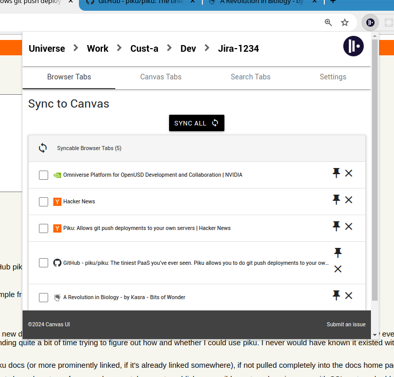
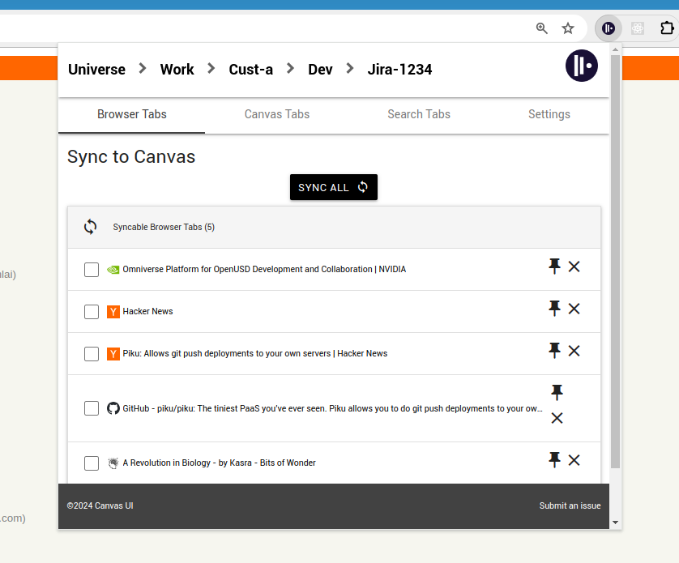

# canvas-ui-broser
Canvas UI browser extension

## Installation Chrome

- git clone https://github.com/idncsk/canvas-ui-browser.git
- cd canvas-ui-browser
- yarn install
- yarn build #(or yarn dev)
- Open Chrome > Extensions > Manage Extensions
- Tick "Developer mode"
- Click on "Load unpacked"
- Select canvas-ui-browser/chromium
- Ensure extension is pinned the toolbar

## Installation Firefox

- git clone https://github.com/idncsk/canvas-ui-browser.git
- cd canvas-ui-browser
- yarn install
- yarn build #(or yarn dev)
- Open Firefox > about:debugging#/runtime/this-firefox
- Load Temporary Add-on
- Select canvas-ui-browser/firefox
- Ensure extension is pinned the toolbar

## Screenshots

