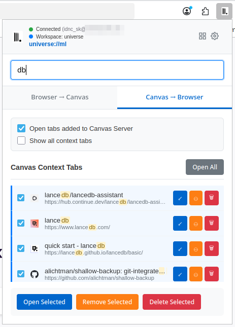
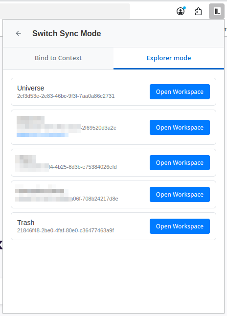

# Canvas Browser Extension

A browser extension for seamlessly syncing browser tabs with Canvas server. Extension allows you to (aot) connect several users / browsers / applications to a single shared context and working with tabs collaboratively.

## Screenshots

### Extension Popup






### Extension Settings


## Installation

### Method 1: Browser Store Installation (Recommended)

| Browser | Store Link |
|---------|------------|
| **Chrome/Chromium** | [Chrome Web Store](https://chromewebstore.google.com/detail/nddefgjgkhcpmgpipifjacmoinoncdgl) |
| **Firefox** | [Firefox Add-ons](https://addons.mozilla.org/en-US/firefox/addon/canvas-browser-extension) |


### Method 2: Download Release Package (TBD)

Download the latest release for your browser:

| Browser | Download |
|---------|----------|
| **Chromium-based** (Chrome, Edge, Brave, Opera) | [📦 canvas-extension-chromium.zip](https://github.com/canvas-ai/canvas-browser-extensions/releases/latest) |
| **Firefox** | [📦 canvas-extension-firefox.zip](https://github.com/canvas-ai/canvas-browser-extensions/releases/latest) |

**Installation steps:**

**Chromium browsers (Chrome, Edge, Brave, etc.):**
1. Download the Chromium package
2. Extract the ZIP file
3. Open `chrome://extensions/`
4. Enable "Developer mode"
5. Click "Load unpacked"
6. Select the extracted folder

**Firefox:**
1. Download the Firefox package
2. Extract the ZIP file
3. Open `about:debugging`
4. Click "This Firefox"
5. Click "Load Temporary Add-on"
6. Select the `manifest.json` file from the extracted folder

### Method 3: Development Installation

For developers and testing:

1. **Install dependencies** (from browser extension directory):
   ```bash
   cd extensions/browser-extensions
   npm install
   ```

2. **Build the extension**:
   ```bash
   # Development build (unminified, with console logs)
   npm run build:dev
   
   # Production build (minified, optimized)
   npm run build
   ```

3. **Load in browser** (same steps as Method 2, but use `packages/chromium/` or `packages/firefox/` directories)

## Setup

1. **Install and run Canvas server** or **create an account via https://getcanvas.org**

2. **Open Canvas web interface and generate an API token**

3. **Configure extension**

## Browser Compatibility

- **Chrome**: v88+
- **Edge**: v88+
- **Firefox**: v109+
- **Brave**: v1.20+
- **Opera**: v74+

## License

Licensed under AGPL-3.0-or-later. See main project LICENSE file. 
